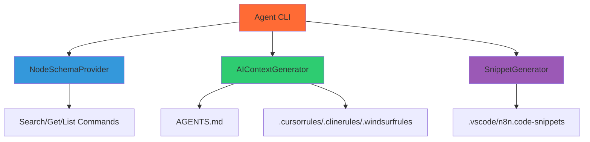

# Agent CLI - AI Integration Documentation

**Note**: This package is used by AI assistants to access n8n node documentation and generate AI context files. It can be used via NPX commands or programmatically.

## 🎯 Purpose

The Agent CLI (`@n8n-as-code/agent-cli`) provides tools for AI assistants to understand and work with n8n workflows. It offers:

1. **Node Schema Access**: Search and retrieve n8n node schemas
2. **AI Context Generation**: Create `AGENTS.md` and AI rule files
3. **Code Snippets**: Generate VS Code snippets for common n8n patterns

## 🏗️ Architecture

### Component Diagram


### Core Components

#### 1. **NodeSchemaProvider**
Provides access to n8n node schemas for AI assistants.

**Key Features:**
- Loads n8n node index from generated JSON
- Supports fuzzy search for nodes
- Returns full JSON schemas for specific nodes
- Lists all available nodes

#### 2. **AIContextGenerator**
Generates AI context files with instructions for AI assistants.

**Key Features:**
- Creates `AGENTS.md` with n8n-as-code context and rules
- Generates specialized rule files (`.cursorrules`, `.clinerules`, `.windsurfrules`)
- Creates `.ai-rules.md` for general AI assistants
- Injects/updates existing files without overwriting user content

#### 3. **SnippetGenerator**
Generates VS Code snippets for common n8n patterns.

**Key Features:**
- Creates code snippets for common n8n nodes
- Supports tab stops and placeholders
- Falls back to hardcoded snippets when node index is unavailable
- Organized by node category

## 📁 Generated Files

### AGENTS.md
```markdown
# 🤖 AI Agents Guidelines

<!-- n8n-as-code-start -->
## 🎭 Role: Expert n8n Engineer
You manage n8n workflows as **clean, version-controlled JSON**.

### 🌍 Context
- **n8n Version**: 2.2.6
- **Source of Truth**: Use `@n8n-as-code/agent-cli` tools to get accurate node schemas from n8n-nodes-index.json.

### 🛠 Coding Standards
1. **Expressions**: Use `{{ $json.field }}` (modern) instead of `{{ $node["Name"].json.field }}` when possible.
2. **Nodes**: Always prefer the `Code` node for custom logic.
3. **Credentials**: NEVER hardcode API keys. Mention needed credentials by name.

### 🔬 Research Protocol (MANDATORY)
Do NOT hallucinate node parameters. Use these tools via `npx @n8n-as-code/agent-cli`:
- `search "<term>"`: Find the correct node named (camelCase).
- `get "<nodeName>"`: Get the EXACT property definitions for a node.
- `list`: See all available nodes.

Apply the Knowledge: Use the `get` tool's output as the absolute source of truth for JSON parameter names.
<!-- n8n-as-code-end -->
```

### AI Rule Files
- `.cursorrules`: Rules for Cursor AI
- `.clinerules`: Rules for Cline AI
- `.windsurfrules`: Rules for Windsurf AI
- `.ai-rules.md`: General rules for all AI assistants

### .vscode/n8n.code-snippets
```json
{
  "n8n-webhook": {
    "prefix": "n8n-webhook",
    "body": [
      "{",
      "  \"parameters\": {\"path\": \"webhook\", \"httpMethod\": \"POST\"},",
      "  \"name\": \"Webhook\",",
      "  \"type\": \"n8n-nodes-base.webhook\",",
      "  \"typeVersion\": 1,",
      "  \"position\": [0, 0]",
      "}"
    ],
    "description": "⚡ Insert a Webhook node"
  }
}
```

## 🔧 Usage

### Command Line Interface
The Agent CLI provides three main commands for AI assistants:

```bash
# Search for nodes by name, display name, or description
npx @n8n-as-code/agent-cli search "google sheets"

# Get full JSON schema for a specific node
npx @n8n-as-code/agent-cli get "httpRequest"

# List all available nodes
npx @n8n-as-code/agent-cli list
```

### Programmatic API
```typescript
import { NodeSchemaProvider, AiContextGenerator, SnippetGenerator } from '@n8n-as-code/agent-cli';

// Access node schemas
const provider = new NodeSchemaProvider();
const schema = provider.getNodeSchema('httpRequest');
const results = provider.searchNodes('google');
const allNodes = provider.listAllNodes();

// Generate AI context files
const aiGenerator = new AiContextGenerator();
await aiGenerator.generate('./project-root', '2.2.6');

// Generate VS Code snippets
const snippetGenerator = new SnippetGenerator();
await snippetGenerator.generate('./project-root');
```

## 🧠 How AI Assistants Use This

### 1. **Node Schema Research**
AI assistants use the CLI commands to:
- Search for the correct node names using `search`
- Get exact parameter definitions using `get`
- Avoid hallucinations by using real n8n node schemas
- Ensure workflow JSON follows n8n's actual structure

### 2. **Context Understanding**
AI assistants read generated files to understand:
- Their role as n8n Automation Engineer
- n8n version and environment context
- Coding standards and syntax rules
- Research protocol for avoiding hallucinations

### 3. **Code Generation**
AI assistants use:
- Generated snippets for common node patterns
- Real node schemas for accurate parameter configuration
- AGENTS.md guidelines for workflow structure

## 🔄 Integration with Other Packages

### VS Code Extension
The VS Code extension can use the Agent CLI programmatically to:
1. Generate AI context files when initializing projects
2. Provide node schema access for AI features
3. Update rule files when n8n version changes

### Main CLI
The main CLI's `init-ai` command uses the Agent CLI internally to:
```bash
n8n-as-code init-ai
```
This generates all AI context files in the current project.

## 🧪 Testing

### Test Structure
```
packages/agent-cli/tests/
├── ai-context-generator.test.ts
├── node-schema-provider.test.ts
└── snippet-generator.test.ts
```

### Test Coverage
- **Unit Tests**: Individual component testing
- **Integration Tests**: End-to-end generation testing
- **Snapshot Tests**: Ensure generated files match expected format

### Running Tests
```bash
cd packages/agent-cli
npm test
```

## 📊 Performance Considerations

### Caching
- Node schemas are cached to avoid repeated API calls
- Generated files are cached with hash comparison
- Only regenerate when source data changes

### Optimization
- Parallel generation of different file types
- Incremental updates for large schemas
- Memory-efficient processing for large node libraries

## 🔐 Security

### Data Handling
- No sensitive data in generated files
- Public n8n documentation only
- No API keys or credentials

### Validation
- Generated files are validated before writing
- Schema validation ensures correctness
- File permissions are set appropriately

## 🚀 Development

### Building
```bash
cd packages/agent-cli
npm run build
```

### Development Mode
```bash
cd packages/agent-cli
npm run dev
```

### Adding New Node Types
1. Update the node schema extraction logic
2. Add new snippet templates
3. Update test snapshots
4. Regenerate context files


## 📚 Related Documentation

- [Architecture Overview](/docs/contribution/architecture): Overall system architecture
- [Core Package](/docs/contribution/core): Shared library details
- [Contribution Guide](/docs/contribution): How to contribute

---

*The Agent CLI enables AI assistants to work effectively with n8n workflows by providing comprehensive context, validation, and code generation capabilities.*